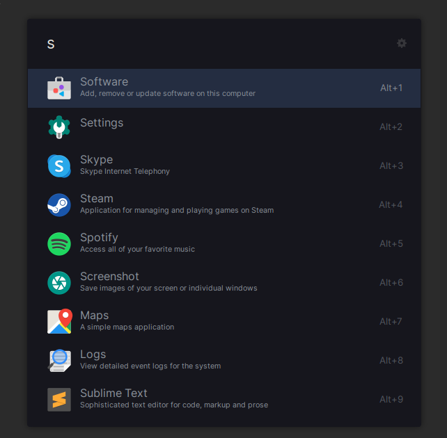

# ulauncher-eigen-dark

Dark theme for for ulauncher based on Eigengrau colours

## Installing

To install this theme, just copy paste the command below in your terminal:

```
git clone https://github.com/sotsugov/ulauncher-eigen/ \
  ~/.config/ulauncher/user-themes/zorin-blue-dark
```

## Manually

Download the zip file from here: https://github.com/sotsugov/ulauncher-eigen/archive/refs/heads/master.zip

and extract the `ulauncher-eigen-main` folder to `/home/YourUsername/.config/ulauncher/user-themes/`

## Preview



### Key colours
```
#16161d;
#1c2333;
#242d41;
#8e959e;
#e6e6e1;
```
